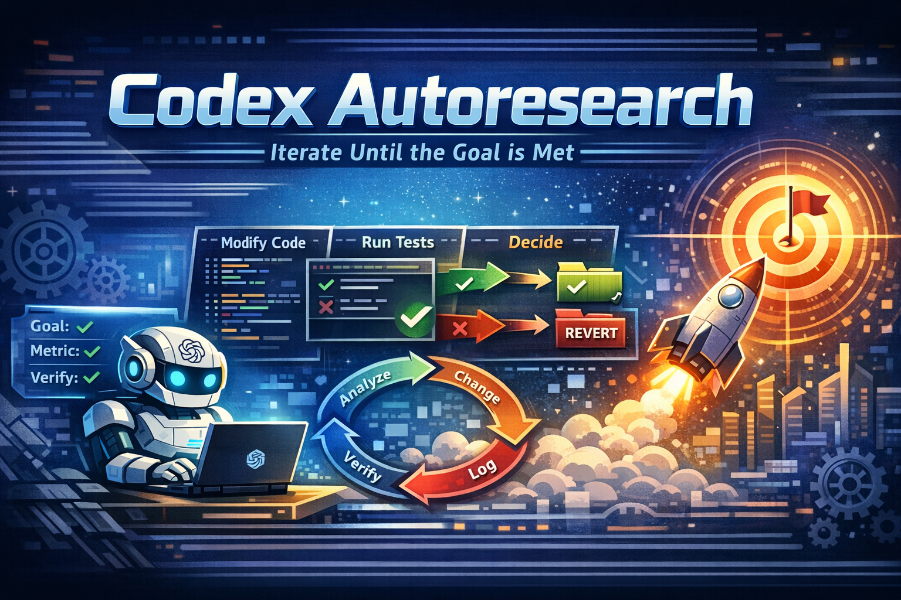

<p align="center">
  
</p>

<h2 align="center"><b>狙う。回す。辿り着く。</b></h2>

<p align="center">
  <i>Codex のための自律型目標駆動実験エンジン。</i>
</p>

<p align="center">
  <a href="https://developers.openai.com/codex/skills"></a>
  <a href="https://github.com/leo-lilinxiao/codex-autoresearch"></a>
  <a href="../../LICENSE"></a>
</p>

<p align="center">
  <a href="../../README.md">English</a> ·
  <a href="README_ZH.md">🇨🇳 中文</a> ·
  <b>🇯🇵 日本語</b> ·
  <a href="README_KO.md">🇰🇷 한국어</a> ·
  <a href="README_FR.md">🇫🇷 Français</a> ·
  <a href="README_DE.md">🇩🇪 Deutsch</a> ·
  <a href="README_ES.md">🇪🇸 Español</a> ·
  <a href="README_PT.md">🇧🇷 Português</a> ·
  <a href="README_RU.md">🇷🇺 Русский</a>
</p>

---

コンセプト：改善したいことを Codex に伝えて、あとは任せる。コードを修正し、結果を検証し、保持か破棄を判断し、繰り返す。戻ってくると、実験ログとより良いコードベースが待っています。

[Karpathy の autoresearch](https://github.com/karpathy/autoresearch) に着想を得て、ML を超えて機械的に検証できるあらゆる目標に汎用化：テストカバレッジ、型エラー、レイテンシ、lint 警告、セキュリティ問題、リリース準備 — コマンドで改善を判定できるなら、ループが反復できます。

## クイックスタート

```text
# Codex にインストール（推奨）
$skill-installer install https://github.com/leo-lilinxiao/codex-autoresearch
```

Codex を再起動してから、プロジェクトで開きます：

```
あなた: $codex-autoresearch
        TypeScript コードの any 型を全て除去してほしい

Codex:  src/**/*.ts に 47 個の `any` が見つかりました。
        指標：any の出現回数（現在 47）、方向：減少
        検証：grep カウント + tsc --noEmit ガード
        実行モード：foreground と background のどちらにしますか？

あなた: Background、go。一晩中走らせて。

Codex:  background 実行を開始 — ベースライン：47。反復中。
```

改善は蓄積され、失敗はロールバックされ、全てが記録されます。

手動コピー、symlink、ユーザースコープの方法は [INSTALL.md](../INSTALL.md)、完全な操作マニュアルは [GUIDE.md](../GUIDE.md) を参照。

## 仕組み

```
一文で伝える  →  Codex がスキャン・確認  →  "go" と言う
                                              |
                                 +------------+------------+
                                 |                         |
                            foreground                background
                          (現在のセッション)        (バックグラウンド、一晩)
                                 |                         |
                                 +------------+------------+
                                              |
                                              v
                                    +-------------------+
                                    |    コアループ      |
                                    |                   |
                                    |  1つ変更する      |
                                    |  git commit       |
                                    |  検証を実行       |
                                    |  改善？ → 保持    |
                                    |  悪化？ → 元に戻す|
                                    |  結果を記録       |
                                    |  繰り返す         |
                                    +-------------------+
```

これだけです。どちらか一つを選びます：foreground は現在のセッションでループを実行し、background はバックグラウンドプロセスに引き継いで席を外せます。同じループですが、同時には実行できません。

## あなたの一言 vs 何が起こるか

| あなたの一言 | 何が起こるか |
|-------------|------------|
| "テストカバレッジを上げて" | 目標達成か中断まで反復 |
| "12個の失敗テストを直して" | 一つずつ修復してゼロになるまで |
| "なぜAPIが503を返すのか？" | 反証可能な仮説で根本原因を追跡 |
| "このコードは安全か？" | STRIDE + OWASP 監査、全発見にコード証拠付き |
| "リリースして" | 準備状況を検証、チェックリスト生成、ゲート付きリリース |
| "最適化したいが何を測ればいいかわからない" | リポジトリを分析、指標を提案、設定を生成 |

裏側では、Codex が 7 つのモード（loop、plan、debug、fix、security、ship、exec）のいずれかにマッピングします。モードを選ぶ必要はありません。

## Codex が自動で把握すること

設定を書く必要はありません。Codex があなたの言葉とリポジトリから全てを推論します：

| 必要な情報 | 取得方法 | 例 |
|-----------|---------|-----|
| 目標 | あなたの一言 | "全てのany型を除去して" |
| スコープ | リポジトリ構造をスキャン | `src/**/*.ts` |
| 指標 | 目標 + ツールチェーンから提案 | any カウント（現在: 47） |
| 方向 | "改善" / "削減" / "除去" から推論 | 減少 |
| 検証コマンド | リポジトリのツールとマッチング | `grep` カウント + `tsc --noEmit` |
| ガード | リグレッションリスクがあれば提案 | `npm test` |

開始前に、Codex は常に検出した内容を提示し、確認を求めます。その後 foreground か background を選んで "go" と言います。

## スタックしたとき

盲目的にリトライせず、段階的にエスカレートします：

| トリガー | アクション |
|----------|-----------|
| 3 回連続の失敗 | **REFINE** — 現在の戦略内で調整 |
| 5 回連続の失敗 | **PIVOT** — 根本的に異なるアプローチを試行 |
| 改善なしの PIVOT 2 回 | **Web 検索** — 外部の解決策を探索 |
| 改善なしの PIVOT 3 回 | **停止** — 人の判断が必要と報告 |

1 回の成功で全てのカウンターがリセットされます。

## 結果ログ

各イテレーションは `autoresearch-results/results.tsv` に記録されます：

```
iteration  commit   metric  delta   status    description
0          a1b2c3d  47      0       baseline  initial any count
1          b2c3d4e  41      -6      keep      replace any in auth module
2          -        49      +8      discard   generic wrapper introduced new anys
3          d4e5f6g  38      -3      keep      type-narrow API response handlers
```

失敗した実験は git からリバートされますが、ログには残ります。ログが本当の監査証跡であり、`autoresearch-results/state.json` は再開用スナップショットです。

## その他の機能

以下は [GUIDE.md](../GUIDE.md) で詳しく説明しています：

- **クロスラン学習** — 過去の実行からの教訓が将来の仮説生成に影響
- **並列実験** — git worktree で最大 3 つの仮説を同時にテスト
- **セッション再開** — 中断された実行は最後の一貫した状態から再開
- **CI/CD モード** (`exec`) — 非対話、JSON 出力、自動化パイプライン向け
- **二重ゲート検証** — verify（改善したか？）と guard（他に壊れていないか？）を分離
- **セッション hooks** — 自動インストール；セッション境界を越えて Codex の状態を維持

## FAQ

**毎回小さな変更しかしない。もっと大きなアイデアを試せる？**
デフォルトでは小さく検証可能なステップを好みます — これは設計通りです。しかしもっと大きなこともできます：プロンプトでより大きな仮説を記述すれば（例：「attention メカニズムを linear attention に置き換えて完全な eval を実行して」）、それを一つの実験として検証します。人が研究の方向を決め、エージェントが実行と分析を担当するのが最適な使い方です。

**これは工学的最適化向き？それとも研究向き？**
目標と指標が明確なときに最も強力です — カバレッジを上げる、エラーを減らす、レイテンシを下げる。研究の方向自体が不確かな場合は、まず `plan` モードで探索し、何を測るか決まったら `loop` に切り替えてください。人間とAIの協業と考えてください：あなたが判断を提供し、エージェントが反復速度を提供します。

**どうやって止める？** Foreground：Codex を中断。Background：`$codex-autoresearch` で停止を依頼。

**中断後に再開できる？** はい。`autoresearch-results/state.json` から自動的に再開します。

**CI で使うには？** `Mode: exec` と `codex exec`。全設定を事前に指定、JSON 出力、終了コード 0/1/2。

## ドキュメント

| ドキュメント | 内容 |
|------------|------|
| [INSTALL.md](../INSTALL.md) | 全インストール方法、skill 発見パス、hooks セットアップ |
| [GUIDE.md](../GUIDE.md) | 完全な操作マニュアル：モード、設定フィールド、安全モデル、高度な使い方 |
| [EXAMPLES.md](../EXAMPLES.md) | 分野別レシピ：カバレッジ、パフォーマンス、型、セキュリティなど |

## 謝辞

[Karpathy の autoresearch](https://github.com/karpathy/autoresearch) の理念を基に構築。Codex skills プラットフォームは [OpenAI](https://openai.com) 提供。

## Star History

<a href="https://www.star-history.com/?repos=leo-lilinxiao%2Fcodex-autoresearch&type=timeline&legend=top-left">
 <picture>
   <source media="(prefers-color-scheme: dark)" srcset="https://api.star-history.com/image?repos=leo-lilinxiao/codex-autoresearch&type=timeline&theme=dark&legend=top-left" />
   <source media="(prefers-color-scheme: light)" srcset="https://api.star-history.com/image?repos=leo-lilinxiao/codex-autoresearch&type=timeline&legend=top-left" />
   
 </picture>
</a>

## ライセンス

MIT — [LICENSE](../../LICENSE) を参照。
